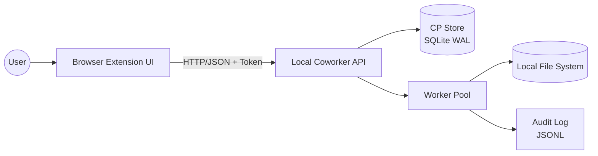
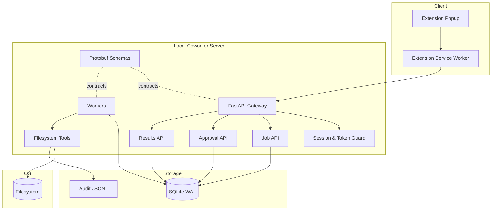
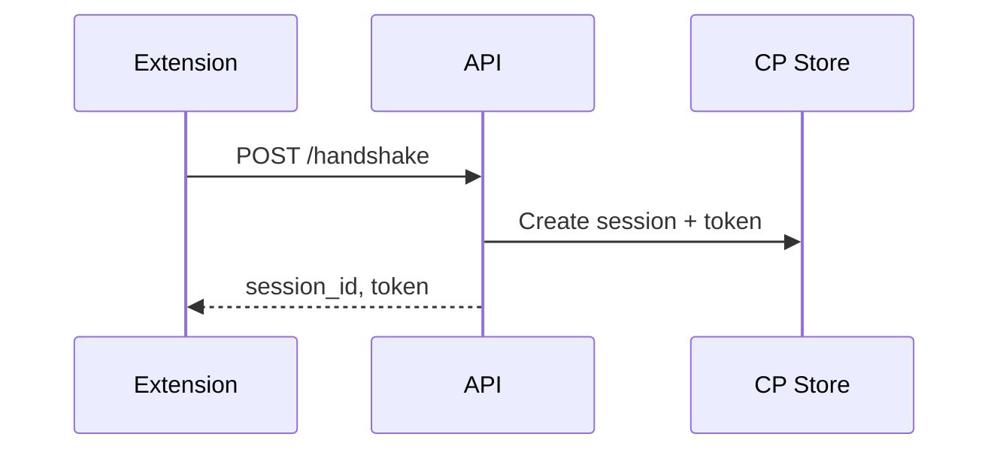
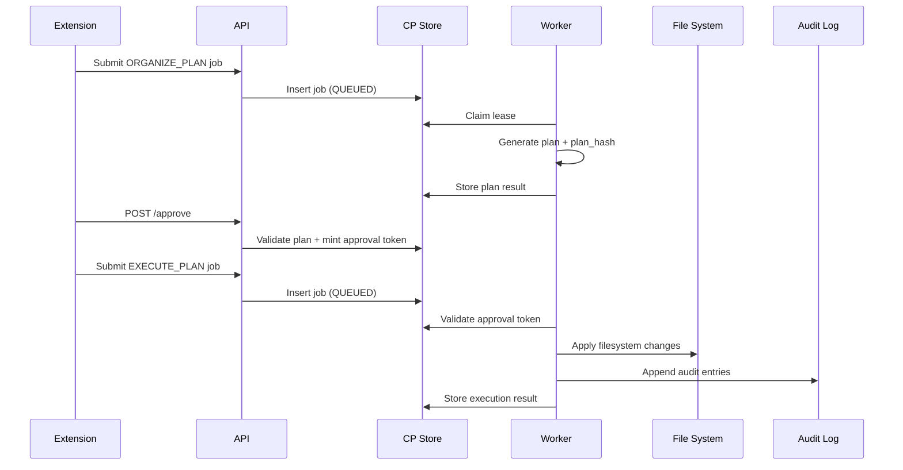
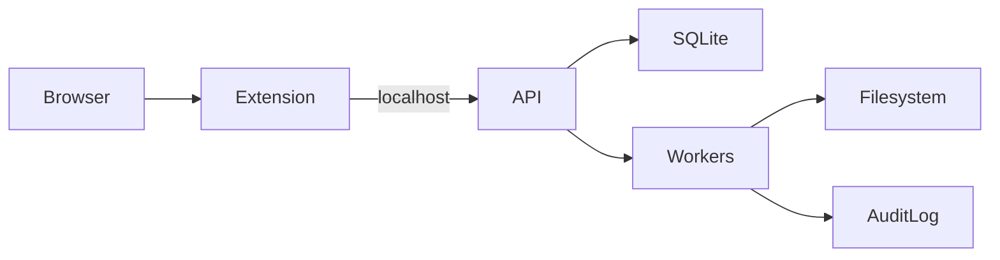
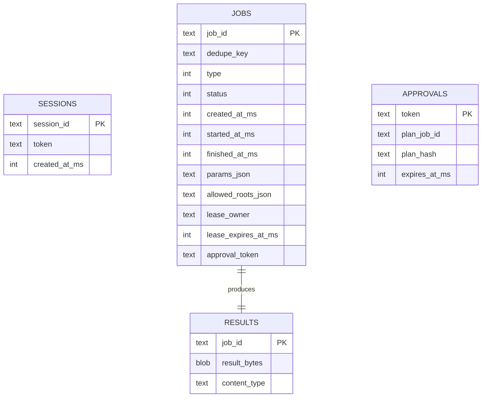

# High-Level Design (HLD) — Coworker MCP (Python)

**Version:** 1.0  
**Status:** Draft (implementation-aligned)

---

## 1. Purpose
This document describes the high-level design for **Coworker MCP**, a local-first AI coworker that safely operates on a user’s filesystem using job-based execution, approval gates, and audit logging. The design is **CAP-aware** and uses **Protocol Buffers (Protobuf)** as the authoritative internal contract.

---

## 2. Goals
- Provide **workspace-scoped** filesystem automation.
- Ensure **safety and correctness** via plans, approvals, and audit logs.
- Use **job orchestration** with idempotency and leases.
- Remain **local-first**, with a clean path to multi-node deployment.

## 3. Non-Goals
- Full multi-node deployment in v1.
- Running code inside the browser extension.
- Hard delete of user files (soft delete only).

---

## 4. CAP Design Rationale

### 4.1 CAP Assumptions
- **Partition tolerance** is assumed (process crashes, restarts, I/O failures).
- The system explicitly chooses **Consistency over Availability** for mutations.

### 4.2 CP (Consistency-First) Components
The following are strongly consistent and transactionally enforced:
- Job lifecycle state
- Idempotency (dedupe keys)
- Worker leases
- Approval tokens
- Execution results
- Audit references

**Rationale:** Incorrect or duplicated file mutations are unacceptable.

### 4.3 AP (Availability-First) Components (Optional/Future)
- Read-only status polling
- Cached search or index data

**Rationale:** Stale reads are acceptable for observation, not for mutation.

---

## 5. System Context

---

## 6. Logical Architecture

---

## 7. Key Flows

### 7.1 Handshake

### 7.2 Plan → Approve → Execute

---

## 8. Deployment View (Local)

---

## 9. Data Model (CP Store)

---

## 10. Security Model

### 10.1 Workspace Enforcement
- All paths are realpath-validated.
- No traversal or symlink escape outside allowed roots.

### 10.2 Localhost Protection
- Every request requires a session token.
- Tokens are issued via explicit handshake.

### 10.3 Safe Mutation
- All write actions require approval tokens.
- Approval tokens bind to a specific plan hash and TTL.

### 10.4 Auditability
- Append-only JSONL audit file inside workspace.
- Every mutation is traceable and reversible.

---

## 11. Reliability Guarantees
- Idempotent job submission via dedupe keys.
- Lease-based worker execution prevents duplication.
- Failed workers can be safely retried after lease expiry.

---

## 12. Extensibility
- Replace SQLite with etcd/CockroachDB for multi-node CP.
- Add AP caches for search and indexing.
- Expose gRPC alongside HTTP without breaking contracts.

---

## 13. Summary
This design prioritizes **correctness, safety, and trust**. By combining CAP-aware state management with Protobuf-defined contracts, Coworker MCP avoids silent failure modes and provides a solid foundation for trustworthy AI-assisted filesystem operations.
